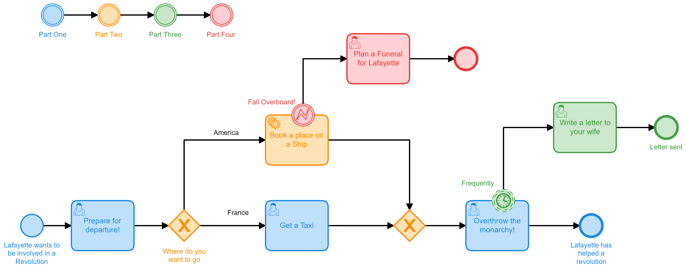
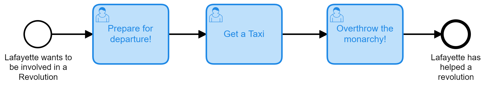
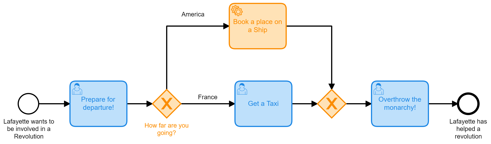
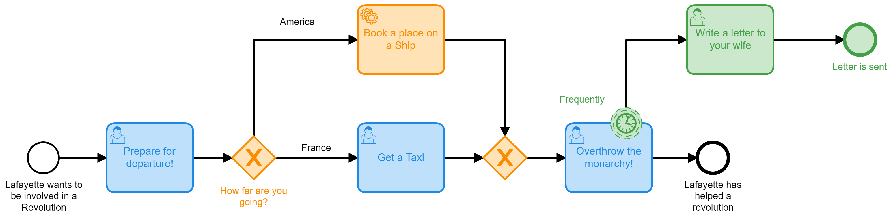
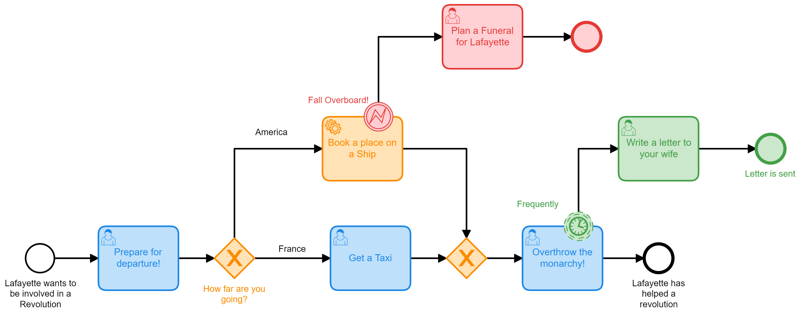

# Example Camunda Platform 7 Spring Boot  
This project is used to show how you can use various features of Camunda 7 in a spring boot application.

## What is this all about?

This is broken up into 4 parts and in the end we're looking a process that will help Lafayette with a more efficient way to ruin things for the French and British monarchy. 

## What you will need 
* [Java JDK 11](https://www.oracle.com/java/technologies/javase-jdk11-downloads.html) so that you can run the Camunda Platform
* [Camunda Modeler](https://camunda.com/download/modeler/) for building and deploying BPMN Models
* An integrated development environment for Java like [IntelliJ IDEA](https://www.jetbrains.com/idea/download/) 

## What will you learn?
* How to setup a spring boot project with Camunda
* Understanding the components of the project
* How to create forms and link them to user tasks
* How to write java classes that can be run by Service Tasks
* How to configure an XOR gateway based on process data
* How to configure non-interrupting timer events
* How to trigger and catch BPMN errors thrown from Java Code

### Part One: Lafayette's Departure 
Using User tasks and Camunda Forms.

### Part Two: Lafayette Crosses the Ocean 
Using Service Tasks, Java Classes and Gateways.

## Part Three: Lafayette Writes Home
Using Timers and User Tasks.

## Part Four: Disaster at Sea for Lafayette
Using Java to throw BPMN Error Events.

References: https://www.youtube.com/watch?v=BwkNceoybvA 
